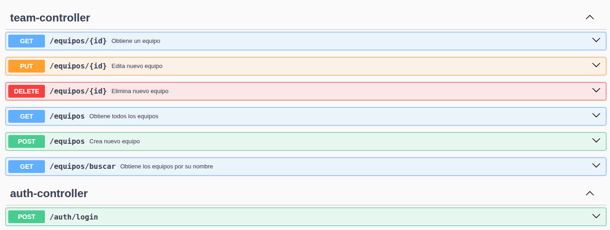
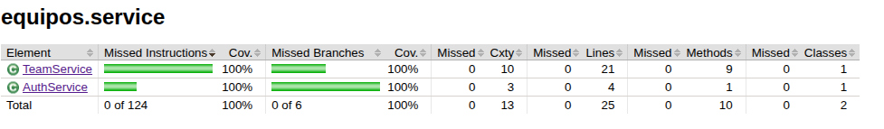

# ⚽ Sistema de Gestión de Equipos - API REST

Una API RESTful moderna para la gestión de equipos de fútbol, desarrollada con Spring Boot 3 y Java 17. Incluye
autenticación JWT, documentación interactiva con Swagger y cobertura de tests completa.


## 📸 Vista Previa

### Swagger UI - Documentación Interactiva



### Cobertura de Tests - Jacoco Report



## 🚀 Características Principales

- **🔐 Autenticación JWT** - Seguridad robusta con tokens
- **📚 Swagger UI** - Documentación interactiva automática
- **✅ 85%+ Cobertura** - Tests con Jacoco y JUnit 5
- **🎯 API RESTful** - Diseño REST estándar
- **🛡️ Spring Security** - Configuración personalizada
- **🗄️ H2 Database** - Base embebida para desarrollo

## 📦 Requisitos Previos

- **Java 17** o superior
- **Maven 3.6** o superior
- **Git**

## ⚡ Instalación en 3 Pasos

### 1. Clonar el Repositorio

```bash
git clone https://github.com/tu-usuario/equipos-api.git
cd equipos-api
```

### 2. Configurar Variables de Entorno

Crear un archivo .env en la raíz del proyecto con el siguiente contenido:

```dotenv
JWT_SECRET=my_authentication_long_key
JWT_EXPIRATION=86400000
```

### 3. Ejecutar la Aplicación

```bash
# Con Maven
mvn clean install
mvn spring-boot:run
```

```bash
# O directamente
java -jar target/equipos-0.0.1-SNAPSHOT.jar
```

### 🎮 Uso Rápido de la API

### 1. Obtener Token de Acceso

```bash
curl -X POST http://localhost:8080/auth/login \
  -H "Content-Type: application/json" \
  -d '{"username":"test", "password":"12345"}'
```

### 2. Usar el Token en Requests

```bash
# Ejemplo: Obtener todos los equipos
curl -X GET http://localhost:8080/equipos \
  -H "Authorization: Bearer TU_TOKEN_JWT"
```

### 📚 Documentación Interactiva

Una vez ejecutando la aplicación:

**📖 Swagger UI:** http://localhost:8080/swagger-ui.html

Cómo usar Swagger:

- Realizar una solicitud al endpoint auth/login con el usuario

```json
{
  "username": "test",
  "password": "12345"
}
```

- Copiar el cuerpo del token recibido en la respuesta
- Hacé click en el botón "Authorize"
- Ingresar el token copiado anteriormente.
- ¡Listo! Probá los endpoints directamente desde la web.

### 🧪 Testing y Cobertura

Ejecutemos los tests!!!

```bash
# Todos los tests
mvn test

# Tests con reporte de cobertura
mvn jacoco:report
```

### Ver Reportes de Cobertura

Abrí en el navegador el siguiente archivo:

```html
target/site/jacoco/index.html
```

### 🔐 Endpoints Principales

#### Autenticación

| Método | Endpoint      | Descripción              |
|--------|---------------|--------------------------|
| POST   | `/auth/login` | Login y obtención de JWT |

#### Gestión de Equipos

| Método | Endpoint        | Descripción              |
|--------|-----------------|--------------------------|
| GET    | `/equipos`      | Listar todos los equipos |
| GET    | `/equipos/{id}` | Obtener equipo por ID    |
| POST   | `/equipos`      | Crear nuevo equipo       |
| PUT    | `/equipos/{id}` | Actualizar equipo        |
| DELETE | `/equipos/{id}` | Eliminar equipo          |

### 🗄️ Base de Datos H2

##### Consola H2:

- URL: http://localhost:8080/h2-console
- JDBC URL: jdbc:h2:mem:testdb
- Usuario: sa
- Password: sa

### 🛠️ Estructura del Proyecto

```text
equipos-api/
├── src/
│   ├── main/
│   │   ├── java/equipos/
│   │   │   ├── configuration/ # Configuraciones del proyecto
│   │   │   ├── controller/    # Controladores REST
│   │   │   ├── exception/     # Manejador de errores y errores customs
│   │   │   ├── model/         # Entidades JPA y dtos
│   │   │   ├── repository/    # Repositorios Data
│   │   │   ├── security/      # JWT y Security
│   │   │   └── service/       # Lógica de negocio
│   │   └── resources/
│   │       ├── application.properties
│   │       └── import.sql     # Data de inicio
│   └── test/                  # Tests unitarios
├── .env                       # Variables de entorno
├── .gitignore
├── pom.xml
└── README.md
```

